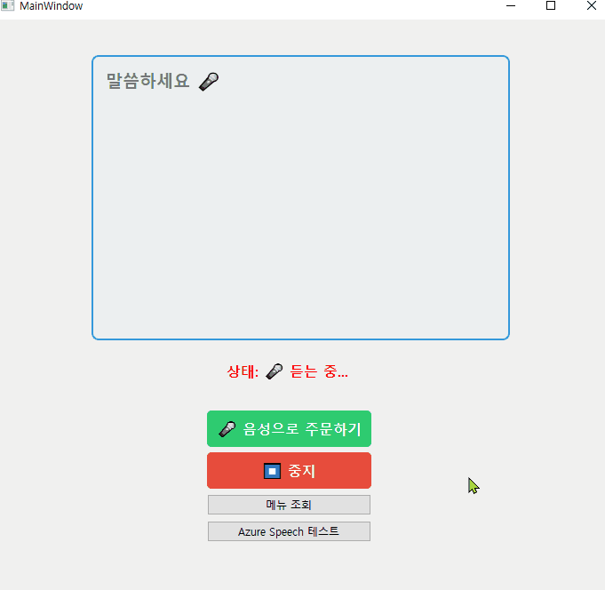
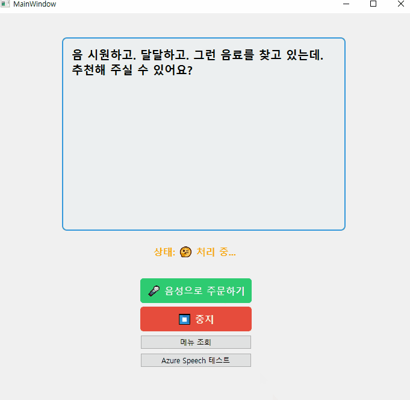
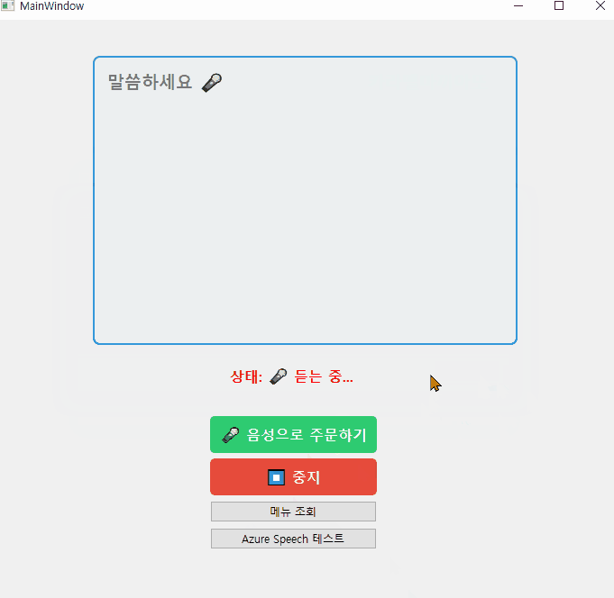

# 🎤 음성 AI 카페 키오스크

시니어 친화적 음성 주문 시스템 (Qt C++ + Django + OpenAI)

## 📋 프로젝트 개요

**목표:** 시니어가 쉽게 사용할 수 있는 음성 AI 카페 키오스크  
**기간:** 2026.02 ~ 2026.03 (진행 중)  

**차별화:**
- ⚡ **실시간 음성 인식** (1-2초 응답)
- 🧠 **대화 메모리** (이전 대화 기억)
- 🛠️ **Function Calling** (AI가 직접 주문 처리)
- 👴 **시니어 친화적 UX** (큰 글씨, 명확한 피드백)
---

## 🎥 데모

### 실시간 음성 주문 (1-2초 응답!)



*말하는 동안 화면에 실시간으로 텍스트가 표시됩니다*



### Function Calling 자동 주문



*기억한 대화 메모리로 AI가 자동으로 메뉴 검색하고 주문을 생성합니다*

---

## ✅ 완료된 기능

### ✨ Stage 1: 기본 음성 시스템 (완료)
- ✅ Qt C++ 프론트엔드
- ✅ Django REST API 백엔드
- ✅ OpenAI Whisper STT (배치)
- ✅ OpenAI GPT-4o-mini + Function Calling
- ✅ OpenAI TTS
- ✅ 대화 메모리
- ✅ 30개 카페 메뉴 DB

### ⚡ Stage 2: 실시간 STT (완료!)
- ✅ Azure Speech SDK C++ 통합
- ✅ 실시간 연속 음성 인식
- ✅ 중간 결과 실시간 표시
- ✅ 자동 문장 끝 감지
- ✅ Qt ↔ Django 실시간 연동
- ✅ **응답 시간: 7-10초 → 1-2초 (5배 개선!)** ⚡

### 🚀 Stage 2-A: FastAPI 백엔드 (완료!)
- ✅ Django → FastAPI 마이그레이션
- ✅ 비동기 처리 (async/await)
- ✅ Dependencies & Yield 패턴
- ✅ 자동 API 문서 (Swagger UI)
- ✅ Pydantic 자동 검증
- ✅ **TTS 응답: 15초 → 3초 (5배 개선!)** ⚡
---
---
## 🚀 변경된 동작 플로우(실시간)
```
👤 사용자: "아메리카노 2잔 주세요" (말하기 시작)
    ↓ (0.3초)
📱 화면: "아메" (실시간 표시 - 회색)
    ↓ (0.3초)
📱 화면: "아메리카노" (업데이트)
    ↓ (0.3초)
📱 화면: "아메리카노 2잔 주세요" (최종 확정 - 검정)
    ↓
🎤 [Azure Speech] 자동 문장 끝 감지
    ↓
📤 [Qt → Django] 텍스트 전송
    ↓
🧠 [OpenAI GPT-4o-mini + Function Calling]
    - 대화 히스토리 참조 💾
    - create_order("아메리카노", 2) 실행 🔧
    ↓
💾 [Django DB] 주문 저장
    ↓
🧠 [GPT-4o-mini] "아메리카노 2잔 주문 완료! 9,000원입니다."
    ↓
🔊 [OpenAI TTS] MP3 생성
    ↓
📥 [Django → Qt] TTS URL 전달
    ↓
🔉 [Qt] 음성 재생
    ↓
👂 사용자: AI 음성 듣기!

```
---

## 🎬 사용 시나리오

### 시나리오 1: 실시간 메뉴 검색
```
사용자: "차가운 거 있어요?"
화면 (실시간): "차가" → "차가운" → "차가운 거 있어요?"

AI 동작:
  1. search_menu(is_cold=True) 도구 호출 🔧
  2. 차가운 음료 목록 반환
  3. "아이스 아메리카노, 아이스 카페라떼, 스무디가 있습니다!"

응답 시간: 1.5초
```

### 시나리오 2: 실시간 주문 생성
```
사용자: "아메리카노 2잔 주세요"
화면 (실시간): "아메" → "아메리카노" → "아메리카노 2잔 주세요"

AI 동작:
  1. create_order("아메리카노", 2) 호출 🔧
  2. DB에 주문 저장 (Order 테이블)
  3. "아메리카노 2잔 주문 완료! 총 9,000원입니다!"

응답 시간: 1.2초
```

### 시나리오 3: 연속 대화 (메모리)
```
대화 1:
사용자: "뭐 있어요?"
AI: "아메리카노, 카페라떼, 카푸치노 등 있습니다."

대화 2:
사용자: "아메리카노 주세요"
AI: "아메리카노 1잔 주문하시겠어요?" (이전 대화 기억!)

대화 3:
사용자: "네"
AI: "주문 완료! 4,500원입니다."
```

### 시나리오 4: 주문 조회
```
사용자: "내가 뭐 주문했지?"

AI 동작:
  1. get_recent_orders() 도구 호출 🔧
  2. DB에서 최근 주문 조회
  3. "아메리카노 2잔 주문하셨습니다!"
```

---

## 🛠️ 기술 스택

### Frontend (Qt C++)
- **Qt 6.10.2** - 크로스플랫폼 UI
- **Qt Multimedia** - 오디오 녹음/재생
- **Qt Network** - HTTP 통신
- **QMediaPlayer** - TTS 음성 재생
- **MinGW 13.1.0** - C++ 컴파일러
- **Azure Speech SDK (C++)** - 실시간 STT

### Backend (~~Django~~ FastAPI Python) 
- **FastAPI** - 비동기 웹 프레임워크 ⭐ NEW
- **Uvicorn** - ASGI 서버 ⭐ NEW
- ~~**Django 5.1**~~ - 웹 프레임워크 (레거시, 병행 가능)
- **Django ORM** - 데이터베이스 (하이브리드 방식)
- **Pydantic** - 자동 데이터 검증 ⭐ NEW
- **SQLite** - 데이터베이스
- **CORS** - 크로스 오리진 처리

### AI/ML
- ~~**OpenAI Whisper**~~ - STT (음성→텍스트) - Azure 사용으로 전환
- **OpenAI GPT-4o-mini** - AI 대화 + Function Calling
- **OpenAI TTS** - 음성 합성 (텍스트→음성)
- ~~**LangChain 1.2.10**~~ - OpenAI 네이티브로 전환
- **Azure Speech Services** - 실시간 STT (ko-KR) ⭐ NEW

### 인프라
- **python-dotenv** - 환경 변수 관리
- **.env** - API 키 보안
- **Media 파일 서빙** - TTS 음성 파일
- **CORS 설정** - Qt ↔ Django 통신

---

## 📦 주요 라이브러리

### Python (~~Django~~ FastAPI)
```bash
# FastAPI 
fastapi=0.135.1             ⭐
uvicorn[standard]=0.41.0    ⭐      

# Django ORM (데이터베이스만)
Django==6.0.2
djangorestframework==3.16.1
django-cors-headers==4.9.0

# AI/ML
openai==2.18.0                      : OpenAI API 사용을 위한 추가
azure-cognitiveservices-speech==1.48.2

# 기타
python-dotenv==1.0.0                : .env사용을 위해 추가
```

**제거된 라이브러리:**
- ~~langchain==1.2.10~~(OpenAI 네이티브로 전환)     : langchain 뼈대
- ~~langchain-openai==0.2.14~~                  : langchain에 openai 연결하기 위한 추가 
- ~~langchain-community==0.3.15~~               : langchain 확장 도구
**이유:** LangChain 1.x에서 AgentExecutor 제거됨 → OpenAI Function Calling 직접 사용

### C++ (Qt)
```cmake
# Azure Speech SDK
D:\Libs\SpeechSDK\
├── include\cxx_api\
├── include\c_api\
├── lib\x64\Microsoft.CognitiveServices.Speech.core.lib
└── bin\x64\Microsoft.CognitiveServices.Speech.core.dll
```

---

## 🎯 핵심 기능

### 1. 실시간 음성 인식 (Azure Speech) ⭐

**특징:**
- 말하는 동안 실시간으로 텍스트 표시
- 중간 결과 (회색) → 최종 결과 (검정)
- 자동 문장 끝 감지
- 한국어 최적화 (ko-KR)

**구현:**
```cpp
// Qt C++ - 연속 음성 인식
azureRecognizer->Recognizing.Connect([this](const auto& e) {
    QString text = QString::fromStdString(e.Result->Text);
    // 중간 결과 실시간 표시 (회색)
    onRecognizingText(text);
});

azureRecognizer->Recognized.Connect([this](const auto& e) {
    QString text = QString::fromStdString(e.Result->Text);
    // 최종 결과 누적 (검정)
    onRecognizedText(text);
});

azureRecognizer->StartContinuousRecognitionAsync();
```
---
### 2. Function Calling (도구 사용)
**AI가 스스로 판단해서 함수 실행!**

**정의된 도구:**
- `search_menu`: 메뉴 검색 (키워드, 카테고리, 온도, 카페인)
- `create_order`: 주문 생성 (메뉴명, 수량)
- `get_recent_orders`: 최근 주문 조회

**구현 방식:**
```python
# voice/tools.py - 실제 함수 구현
def create_order(menu_name: str, quantity: int = 1) -> str:
    # DB에 주문 저장
    order = Order.objects.create(menu=menu, quantity=quantity)
    return json.dumps({"success": True, "total_price": order.total_price})

# voice/views.py - OpenAI Function Calling
TOOLS = [
    {
        "type": "function",
        "function": {
            "name": "create_order",
            "description": "메뉴를 주문합니다",
            "parameters": {...}
        }
    }
]
```

### 3. 대화 메모리
**이전 대화 기억!**
```python
# OpenAI 네이티브 메모리 
conversation_history = []

conversation_history.append({"role": "user", "content": "뭐 있어요?"})
conversation_history.append({"role": "assistant", "content": "물냉면..."})
```

### 4. 30개 카페 메뉴 DB
**fixtures로 한 번에 로드!**
```bash
python manage.py loaddata fixtures/menu_data.json
```

### 5. FastAPI 백엔드 아키텍처 ⭐ NEW
- 비동기 처리로 빠른 응답 추구
- 자동 API 문서 (Swagger UI)
- 로깅 추가 - Dependencies & Yield 패턴
- Django ORM 하이브리드 방식

---

## 📂 프로젝트 구조
```
Kiosk_BackEnd_step1/
│
├── main.py                    # FastAPI 서버 ⭐ NEW
├── KioskBackend/              # Django (ORM만 사용)
│   ├── fixtures/
│   │   └── menu_data.json    # 30개 메뉴
│   ├── kiosk_server/
│   │   ├── settings.py
│   │   └── urls.py
│   ├── menu/
│   │   ├── models.py         # MenuItem
│   │   └── admin.py
│   ├── order/
│   │   ├── models.py         # Order
│   │   └── admin.py
│   ├── voice/
│   │   ├── views.py          # API (upload, process_text)
│   │   ├── tools.py          # Function Calling 도구
│   │   └── urls.py           # (레거시)
│   ├── media/
│   │   ├── voices/           # 녹음 파일 
│   │   └── tts/              # TTS 음성
│   ├── .env                  # API 키
│   ├── uv.lock
│   └── pyproject.toml
│
├── Client_Qt/
│   └── Kiosk/                # Qt 프론트엔드
│       ├── CMakeLists.txt    # Azure SDK 설정
│       ├── main.cpp
│       ├── mainwindow.h      # Azure 헤더
│       ├── mainwindow.cpp    # 실시간 인식 구현
│       └── mainwindow.ui     # UI (QTextEdit, QLabel)
└── docs/                      # 문서
    └── TIL/                   # 학습 기록
```


---

## 🚀 실행 방법

### 1. ~~Django~~ FastAPI 백엔드 실행

**가상환경 활성화:**
```bash
# Windows
.venv\Scripts\activate

# Mac/Linux
source .venv/bin/activate
```

**패키지 설치:**
*uv 사용*
```bash
uv sync
```
*pip 사용:*
```bash
pip install -r requirements.txt
```

**.env 파일 생성:**
```bash
OPENAI_API_KEY=sk-proj-your-key-here
AZURE_SPEECH_KEY=your-azure-key
AZURE_SPEECH_REGION=koreacentral
```

**DB 초기화:**
```bash
# 마이그레이션
python manage.py migrate

# 메뉴 데이터 로드
python manage.py loaddata fixtures/menu_data.json
```

**서버 실행:**
```bash
uvicorn main:app --reload
```

**자동 API 문서:**
- Swagger UI: http://127.0.0.1:8000/docs
- ReDoc: http://127.0.0.1:8000/redoc

**Django (레거시):**
```bash
# 필요시 Django 서버도 사용 가능
python manage.py runserver
```
---

### 2. Azure Speech 설정

**Azure Portal:**
1. https://portal.azure.com 접속
2. Speech Services 리소스 생성
3. 키 및 엔드포인트 복사

**Qt Creator 환경변수 설정:**
```
Projects → Run → Environment

AZURE_SPEECH_KEY=your-azure-key
AZURE_SPEECH_REGION=koreacentral
```

---

### 3. Qt 프론트엔드 실행
```
1. Qt Creator 실행
2. CMakeLists.txt 열기
3. Configure Project (MinGW 64-bit 선택)
4. Ctrl+R (빌드 & 실행)
```

### 4. 테스트
```
1. "🎤 음성으로 주문하기" 버튼 클릭
2. "아메리카노 2잔 주세요" 등 주문 관련 말하기
3. 실시간으로 화면에 표시되는 거 확인!
4. "⏹️ 중지" 클릭
5. AI 응답 & TTS 재생 듣기!
```

---

## 📊 API 엔드포인트
**FastAPI (현재):**
```
GET  /
  - API 정보 및 상태

POST /api/voice/process_text/
  - 텍스트 직접 처리 (Azure 실시간 STT)
  - 요청: {text: "아메리카노 주세요"}
  - 응답: {user_message, ai_response, tts_url}
  - 자동 로깅 & 검증

GET  /api/menu/items/
  - 메뉴 목록 조회

GET  /health
  - 헬스 체크

GET  /docs
  - Swagger UI (자동 API 문서) ⭐

GET  /redoc
  - ReDoc (대안 문서)
```
**Django (레거시):**
```
POST /api/voice/upload/
  - ~~현재 사용 안 함~~ (Azure로 전환)
  - 음성 파일 업로드 (- Whisper)
  - STT → AI → TTS
  - 응답: {user_message, ai_response, tts_url}

POST /admin/
  - Django 관리자 페이지 (DB 관리용)
```

---

## 🎓 학습 포인트

### AI 특강 적용 (2026.02.19)
- **Function Calling** 구현 (도구 정의 + 실행 라우터 분리)
- **OpenAI 네이티브 방식** (LangChain 의존성 제거)
- **대화 메모리** (conversation_history)
- **도구 실행 결과를 AI가 자연스럽게 전달**

### 기술 전환
- **LangChain 1.x 문제:** AgentExecutor 제거됨
- **해결:** OpenAI Function Calling 직접 사용
- **특강 스타일:** 도구 정의 + 함수 구현 + 라우터 분리

### Azure Speech SDK 통합(2026.03.04)
- C++ 네이티브 SDK 사용
- 연속 음성 인식 (StartContinuousRecognitionAsync)
- 이벤트 핸들러 (Recognizing, Recognized, Canceled)

### FastAPI 강의 적용 (2026.03.06)
- **Django → FastAPI 전환** (하이브리드 방식)
- **비동기 프로그래밍** (async/await, sync_to_async)
- **Dependencies & Yield 패턴** (요청 로깅)
- **Pydantic 자동 검증** (타입 안전)
---

## 💡 참고 자료

**OpenAI:**
- Whisper: https://platform.openai.com/docs/guides/speech-to-text
- Function Calling: https://platform.openai.com/docs/guides/function-calling
- TTS: https://platform.openai.com/docs/guides/text-to-speech

**Qt:**
- Qt 6 Docs: https://doc.qt.io/qt-6/
- Qt Multimedia: https://doc.qt.io/qt-6/qtmultimedia-index.html

**Django:**
- Django REST Framework: https://www.django-rest-framework.org/

**Azure:**
- Azure Speech: https://learn.microsoft.com/azure/ai-services/speech-service/
- Speech SDK (C++): https://learn.microsoft.com/azure/ai-services/speech-service/quickstarts/setup-platform

**FastAPI:**
- FastAPI 공식: https://fastapi.tiangolo.com/
- Uvicorn: https://www.uvicorn.org/
- Pydantic: https://docs.pydantic.dev/
- Dependencies: https://fastapi.tiangolo.com/tutorial/dependencies/

## 📝 라이선스

개인 포트폴리오 프로젝트
